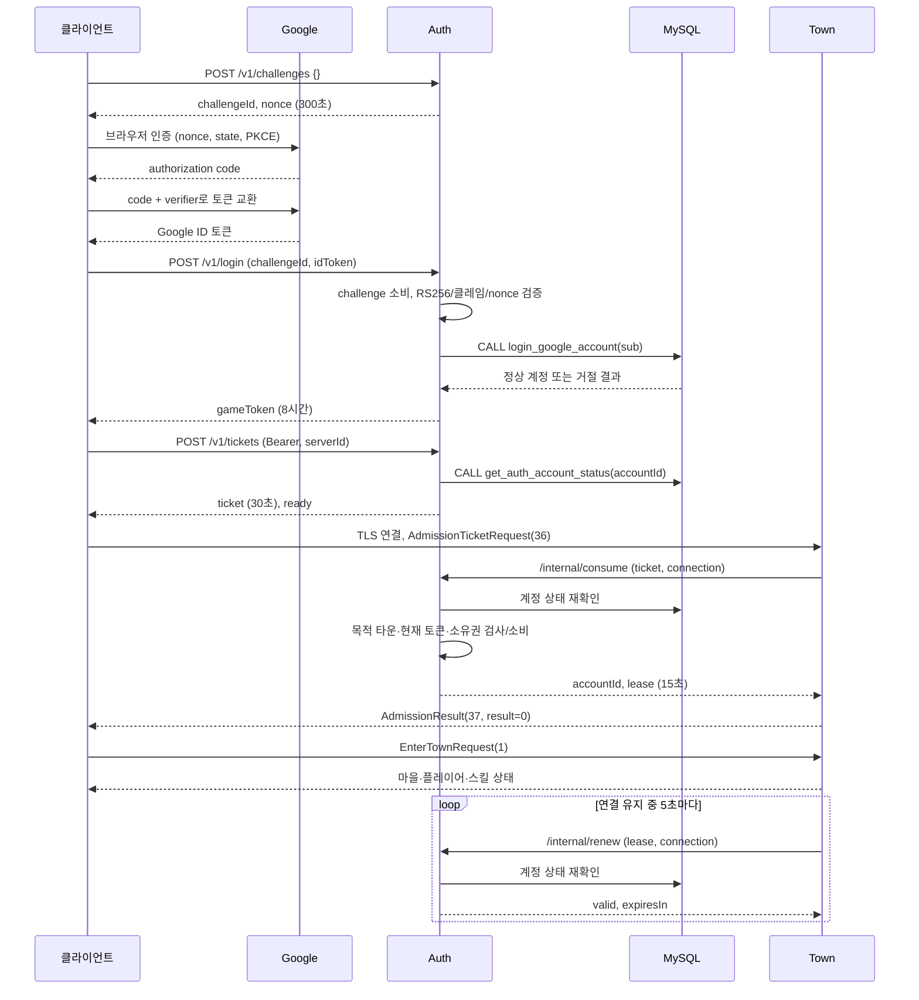

# AuthServer 개발 계약

AuthServer는 계정 로그인과 게임 세션을 소유한다. TownServer는 Auth가 승인한 목적 서버
티켓을 소비하여 입장한다. 룸의 전투 프레임마다 Auth를 호출하지 않는다.

## 실행 전제와 현재 상태

솔루션에 C++20/x64 AuthServer 프로젝트를 추가했다. 기존 vcpkg manifest에 OpenSSL,
jwt-cpp, cpp-httplib의 HTTPS 기능을 선언했다. cpp-httplib 0.40.0 ZIP 오버레이와 MSVC
외부 헤더 경고 처리도 반영했다. 이 문서는 2026-10-06 소스 정적 대조 결과이며 이번 문서
작업에서는 설치·빌드·테스트·서버 실행을 수행하지 않았다. 기존 빌드 산출물이 있다는 사실을
현재 인증 왕복과 배포 환경의 검증 완료로 간주하지 않는다.

계정 DB는 MySQL 8.0.46의 V000001 → V000002 → V000003 → V000004 → V000005 → V000006 계약이다.
[DB 마이그레이션 규칙](../../docs/workflows/DATABASE_MIGRATIONS.md)에 따라 서비스가 종료된
상태에서 별도 수동 Up/Down 실행기를 사용한다. Auth가 마이그레이션을 자동 실행하지 않는다.
Up의 `-CreateDatabase` 옵션으로 대상 DB 생성부터 수행할 수 있으며 생성 권한은 마이그레이션
주체가 갖는다. Auth 계정에는 DB 생성 권한을 부여하지 않는다.
배포 순서는 관련 서비스 종료 → 수동 Up → 새 검사 프로시저 EXECUTE 부여 → 같은 SQL 13개 배포 → Auth 검증 기동 → 타운/룸
기동이다. Up은 미적용 버전을 순서대로 모두 적용하고 Down은 현재 최상위 버전 한 단계만
되돌린다. V1 Down은 계정과 외부 식별자 테이블이 비어 있을 때만 허용하며 V0 이력은 유지한다.

기동 시 실제 계정 DB의 `get_item_use_schema_migration_history()`를 공통 ODBC 실행기로 호출한다.
기존 V0/V4/V5 검사와 권한은 보존하며 새 검사 EXECUTE를 별도로 준비한다. V5는 캐릭터별
revision·소유 세대·아이템·성공 요청 이력을 추가하고, 저장/복원은 Town 공개 프로시저가 담당한다.
V6는 아이템 사용 예약·결과·쿨타임을 추가한다. Town은 예약 커밋 뒤 Room에 효과를 요청하고
결과를 정산한다. Pending 사용은 저장·소유권 해제·새 캐릭터 입장을 막는다. V6에서 재생성한
claim/save/release와 새 사용 프로시저의 EXECUTE도 DB 배포 문서에 따라 다시 부여해야 한다.
조회 프로시저는 마이그레이션과 같은 DB 잠금을 획득해 메타데이터와 적용 이력을 읽는다.
전체 이력의 증가 순서·Up/Down 스택·성공 상태·양방향 파일 체크섬을 검증하며, 실제 테이블
컬럼·기본값·CHECK 활성화·인덱스·외래키 대상/규칙·프로시저 본문/입력 계약도 대조한다.
CHECK 메타데이터의 알려진 문자셋 뒤 ASCII 문자열 경계에 붙은 역슬래시는 비교 시만 해제한다.
문자열 대소문자와 `_binary`는 보존하며 다른 미지원 이스케이프는 거절한다. 배포 SQL과
프로시저 본문에는 이 변환을 적용하지 않고 파일 체크섬도 그대로 검증한다.
CHECK 함수 호출의 `OCTET_LENGTH`와 MySQL이 출력하는 동의어 `LENGTH`는 같은 바이트 길이
함수로 비교한다. 문자열 리터럴·배포 SQL·프로시저 본문에는 이 별칭 변환을 적용하지 않는다.
접속 제한 5초는 MySQL이 지원하는 `SQL_ATTR_LOGIN_TIMEOUT`으로 설정·확인한다.
미지원 `SQL_ATTR_CONNECTION_TIMEOUT`은 요구하지 않는다. 로그인 제한은 연결 수립에 적용되며
이후 모든 네트워크 I/O의 전체 제한시간을 의미하지 않는다. 쿼리 제한은 별도로 설정·확인한다.
총 24개 결과셋 중 마지막 17개는 `SHOW CREATE PROCEDURE` 원본 정의다. MySQL의
`ROUTINE_DEFINITION`은 문자셋 표기를 제거하므로 본문 비교에는 원본 정의를 사용한다.
조회 프로시저의 definer는 대상 열일곱 프로시저의 원본을 볼 권한이 필요하다. 원본이 NULL이거나
생성 SQL mode에 strict가 없거나 `NO_BACKSLASH_ESCAPES`/`ANSI_QUOTES`/`PIPES_AS_CONCAT`이
있으면 거절한다. 원본 조회를 위해 앱 계정에 SHOW_ROUTINE을 추가하지 않고 조회 프로시저
EXECUTE를 사용한다. 로그인·계정 상태 조회 프로시저의 EXECUTE 권한도 별도로 필요하다.
기반 V0은 최초 한 번이며 현재 적용 head=6에서만 해당 ODBC DB에 결합된 증명을 발급한다.
기존 head=4/5는 새 Auth에서 로그인·입장이 차단된다. V6 Down 후에도 V6 감사 이력이 남아
과거 Auth로 즉시 복귀할 수 없다. 수동 전환·역변환 계약은 DB 마이그레이션 문서를 따른다.
초기 V0 FAILED 바로 다음에 같은 체크섬의 V0/UP/SUCCEEDED `migration_history_recovery` 행이
있는 경우만 명시적 복구로 인정한다. 복구 시작 시각은 기존 실패 완료 시각 이후여야 하며 실행 ID도
증가해야 한다. 정상 V0 이력 직후 첫 V1 UP FAILED도 바로 다음에 양방향 체크섬이 일치하는
V1/UP/SUCCEEDED `create_login_accounts_recovery` 행이 있으면 인정한다. 이 경우에도 확인 시작
시각이 실패 완료 시각 이후여야 한다. 원래 실패 행은 보존하며 다른 실패/RUNNING·중복 복구·
복구 행 단독 이력은 거절한다. V1 복구 후 Up/Down을 거친 재실패에는 이 예외를 적용하지 않는다.
이 이력 계약은 수정된 Auth 바이너리에만 적용되므로 해당 소스로 다시 빌드한 뒤 기동해야 한다.

SQL 체크섬은 엄격한 UTF-8, 첫 BOM 제거, CRLF/CR→LF, 나머지 공백/끝 개행 보존 후
BOM 없는 UTF-8 SHA256 소문자 hex64다. 미적용·진행 중·미복구 실패 이력·구조/체크섬 불일치·조회
실패에는 로그인/입장/갱신 503을 반환한다. 로그아웃과 기존 소유권 해제는 이 게이트 밖이다.
기동 검증은 15초까지 기다리며 시간 초과/실패 후에는 DB가 정상화되어도 재시작하여 재검증한다.
실패 로그는 검증 단계와 DB 오류 분류·SQLSTATE·native code·고정된 오류 문맥을 표시한다. 결과
매핑 실패에는 결과셋(0부터)·행/열(1부터) 번호, 개수 또는 ODBC 자료형 번호도 포함한다. 접속 문자열·비밀번호·
드라이버 오류 원문·조회 데이터는 표시하지 않는다. 상세 진단에는 이 소스로 재빌드한 Auth가 필요하다.
이 증명은 기동 시점 확인이며 서비스 중 DDL/파일 변경을 허용하지 않는 배포 조건이 필수다.

이번 문서 작업에서 실제 DB 접속/적용은 수행하지 않았다. 파일과 코드 작성만으로 운영 준비를 확인한 것은
아니다. 공통 ODBC 한도는 전체 결과 4096행/24셋/4MiB이며 누적 이력이 이를 넘으면 차단한다.
실제 MySQL 메타데이터 표기와 프로시저 본문 매핑도 실행 확인이 필요하다.

## 설정

비밀 값을 저장소나 명령 인자에 기록하지 않고 프로세스 환경으로 제공한다.

| 환경 변수 | 용도 |
|---|---|
| `ACTIONRPG_AUTH_TLS_CERT` / `ACTIONRPG_AUTH_TLS_KEY` | HTTPS 인증서 체인 및 개인 키 파일 |
| `ACTIONRPG_AUTH_CA_FILE` | Google 및 타운의 Auth HTTPS 서버 검증용 CA PEM 파일 |
| `ACTIONRPG_GOOGLE_CLIENT_ID` | 허용 Google audience 및 authorized party |
| `ACTIONRPG_AUTH_TOWN_REGISTRY` | 타운 ID에서 각각의 64자리 소문자 hex 비밀 키로 매핑하는 JSON 객체 |
| `ACTIONRPG_DB_CONNECTION_STRING` | 계정 DB ODBC 연결 문자열 |
| `ACTIONRPG_DB_SCHEMA` | 실제 조회 DATABASE()와 대조할 계정 스키마 이름 |
| `ACTIONRPG_DB_MIGRATIONS_DIRECTORY` | Infrastructure/Down 및 Up SQL이 있는 배포 MySQL 디렉터리의 절대 경로 |

Auth HTTPS 포트는 8443이다. 타운은 `ACTIONRPG_AUTH_HOST`의 인증서 호스트명을 검증하며,
`ACTIONRPG_TOWN_ID`/`ACTIONRPG_TOWN_AUTH_KEY`를 Auth 등록값과 일치시킨다.

서버의 listening 로그는 실제 포트 bind/listen 성공 뒤에만 출력한다. bind/listen 및 accept 실패에는
고정 stage와 숫자 httplib 오류·Winsock 오류를 출력하며 요청·헤더·토큰·환경 값은 기록하지 않는다.
`last_WSA_error`는 실패 반환 뒤의 보조 진단이며, 라이브러리 콜백의 `WSA_error`가 소켓 정리 전 값이다.
8443의 점유·제외 포트 범위·로컬 보안 정책을 확인하고, 실패 시 임의 포트 변경이나 자동 재시도는 하지 않는다.
타운 클라이언트에도 별도 TLS 인증서와 키가 필요하다. 인증서 발급·키 생성은 수행하지 않았다.
내부 API는 HTTPS에서 서버별 키를 확인한다. 외부 클라이언트에 타운 키를 배포하지 않는다.
배포 시 내부 API 접근을 타운 네트워크로 제한한다. 현재 RoomControl의 기존 로컬 연결
계약은 유지한다. 여러 타운은 각자의 RoomControl/RoomServer 묶음과 고유 타운 ID를 사용한다.

## HTTPS API

모든 POST body는 JSON 객체다. 세션 토큰은 `Authorization: Bearer <gameToken>` 헤더로
제출한다. 응답은 `Cache-Control: no-store`이며 실패 body에 자격 증명을 포함하지 않는다.

| 경로 | 입력 | 성공 응답 |
|---|---|---|
| `/v1/challenges` | `{}` | `challengeId`, `nonce`, `expiresIn=300` |
| `/v1/login` | `challengeId`, `idToken` | `gameToken`, `expiresIn=28800` |
| `/v1/tickets` | Bearer + `serverId` | `ticket`, `expiresIn=30`, `ready` |
| `/v1/logout` | Bearer + `{}` | `{}` |
| `/internal/consume` | `ticket`, `connection` | `accountId`, `lease`, `expiresIn=15` |
| `/internal/renew` | `lease`, `connection` | `valid`, `expiresIn` |
| `/internal/release` | `lease`, `connection` | `{}` |

내부 요청은 `X-Town-Id`, `X-Town-Key` 헤더가 필수다. `connection`은 타운에서 새 연결마다
생성하는 256비트 임의 값이다. 티켓과 권한은 목적 타운·연결에 결합되고 클라이언트가 계정
ID를 선택할 수 없다. 권한을 해제하는 release는 타운이 모든 게임 접속 종료를 확인한 뒤 호출한다.
성공은 HTTP 200, 미준비 DB 이력 게이트는 503, 거절/의존 서비스 실패는 403이다.
서버 키 불일치는 401이다. 완료 여부가 불확실한 요청은 자동 재시도하지 않는다.

클라이언트 흐름: challenge 발급 → 해당 nonce를 Google OIDC 인증 요청에 연결 → ID 토큰
제출 → 게임 토큰 보관 → 목적 타운 티켓 발급 → 타운 TLS 첫 패킷 36 → 성공 패킷 37 →
기존 EnterTown. `ready=false`이면 기존 접속 종료 후 새 티켓을 받아야 한다. 아직 소유자가
남아 있을 때 소비한 티켓도 재사용되지 않는다. 토큰을 URL/로그에 넣지 않는다.
현재 클라이언트 소스의 AuthClient/LoginFlow에는 시스템 브라우저·PKCE·state·loopback
callback과 nonce 연동 경로가 있다. 실제 Google 등록·배포 설정과 왕복 동작은 별도 검증 대상이다.
Google이 Desktop client secret을 요구하는 등록에서는 클라이언트가 같은 Desktop ID의 값을
Google 토큰 교환 요청에만 포함한다. 로컬 실행기는 기존 DPAPI 프로필에 보관한 값을 클라이언트
프로세스에만 공급하며 Auth API와 AuthServer에는 전달하지 않는다. PKCE·nonce와 ID 토큰 검증은 유지한다.
클라이언트 설정은 [클라이언트 사용 문서](../../../ActionRPGClient/ActionRPGClient/README.md)를 따른다.

## 검증과 중복 로그인

Google 토큰은 고정 Google JWKS HTTPS 주소에서 받은 RSA 키로 RS256 서명을 검사한다.
키 캐시는 Cache-Control 유효 기간을 최대 24시간으로 제한하며 unknown kid 갱신은
30초 간격으로 제한한다. 만료 키를 장애 시 계속 사용하지 않는다. issuer, audience,
authorized party, exp, iat, sub, 일회성 challenge nonce를 검사한다. 하나의 허용 client ID
계약이며 웹/네이티브의 여러 authorized party 허용은 별도 협의가 필요하다.

새 로그인은 기존 게임 토큰을 무효화하고 기존 타운 권한의 갱신을 거절한다. 기존 타운은
5초 갱신 주기에서 이를 확인해 TCP를 종료하고 던전 퇴장을 확인한다. 새 세션의 입장은
기존 소유권 해제 후 허용한다. 타운 이동도 같은 흐름이며 게임 토큰은 재사용한다.
로그인 계정 생성 결과와 상태 조회 결과는 커밋 전에 형식을 검증한다. 정지/없는 계정은
티켓 발급·소비·갱신에서 거절하고 기존 게임 토큰과 미사용 티켓을 폐기한다.
상태 조회 절차는 계정 로그인 시각을 갱신하지 않는다.

SessionRegistry의 메모리 상태 변경은 하나의 mutex로 직렬화하고 DB/HTTPS 호출은 그 잠금 밖에서 수행한다.
Auth HTTP worker 8개/대기 64개, challenge·계정·티켓 각각 최대 10000개다. 만료 challenge와
티켓, 소유자가 없는 만료 계정은 제거한다. Auth DB 완료는 독립 I/O 스레드에서 전달된다.

## 장애 및 미구현 범위

세션은 단일 Auth 프로세스 메모리에만 존재한다. Auth 재시작은 토큰을 무효화한다.
재시작 전에 모든 타운/룸 접속을 종료하고 확인해야 한다. 이전 소유권이 사라진 상태에서
살아 있는 이전 게임 서버와 새 인증 프로세스를 동시에 운영하는 재시작은 지원하지 않는다.
다중 Auth, 공유 세션 저장소, 장애 후 자동 소유권 회복은 구현하지 않았다.

소유권은 타운 권한이 만료돼도 자동 해제하지 않는다. 퇴장 확인/해제 응답 유실이나 타운
장애 시 새 접속이 막히며, 운영자가 기존 타운과 룸을 종료하고 확인해야 한다. 이를 확인하지
않는 관리 해제 API는 제공하지 않는다. HTTP/DB 불확실한 결과의 무조건 재시도도 없다.

타운 간 캐릭터·스킬·진행 상태 저장/이관은 포함하지 않았다. 타운 이동은 접속 권한을
옮기는 기능이며 현재 메모리 기반 캐릭터 진행 상태를 보존하는 기능은 별도 구현 대상이다.

근거: [Google ID 토큰 서버 검증](https://developers.google.com/identity/sign-in/web/backend-auth),
[Google OIDC nonce](https://developers.google.com/identity/openid-connect/openid-connect),
[cpp-httplib HTTPS](https://github.com/yhirose/cpp-httplib), [jwt-cpp](https://github.com/Thalhammer/jwt-cpp).

## 로그인 단계별 실행 경로

Auth는 Google 로그인 페이지나 OAuth callback을 제공하지 않으며 authorization code를
교환하지 않는다. 현재 네이티브 클라이언트가 Google 인증 코드 교환을 처리하고, Auth에는
ID 토큰만 제출한다. Google access token과 Auth gameToken은 ID 토큰의 대체 입력이 아니다.

1. `main.cpp`가 요청 body와 내부 키/DB 준비 게이트를 확인한다. login은 challenge를 먼저
   소비하므로 JWT 검증이나 DB 단계가 실패해도 그 challenge로 다시 시도할 수 없다.
2. `GoogleIdTokenVerifier::Verify()`가 최대 16KiB JWT의 alg=RS256, RSA 서명과 Google issuer,
   설정 client ID의 aud/azp, exp/iat, nonce 및 sub를 검사한다. 다중 aud에는 azp가 필요하다.
   Google sub는 비어 있지 않은 최대 255바이트 ASCII 값이며 계정 키는 `(google, sub)`다.
   이메일·클라이언트 이름·클라이언트가 선택한 accountId로 계정을 결정하지 않는다.
3. `login_google_account`가 정상 계정을 조회하거나 최초 계정/외부 식별자를 생성한다.
   ODBC 어댑터는 결과 형식·필수 행·범위를 커밋 전에 검증한다. Auth는 DB 실행 성공과
   resultCode=0을 모두 만족해야 게임 세션을 발급한다.
4. `SessionRegistry::Login()`이 기존 토큰을 무효화하고 새 토큰을 발급한다. gameToken은
   JWT가 아니라 OpenSSL 난수 32바이트의 64자리 소문자 hex다. 클라이언트가 내용을 해석하지 않는다.
5. 티켓 발급·소비·권한 갱신은 `get_auth_account_status`로 계정 상태를 다시 확인한다.
   정상=0, 정지=1, 부재=2이며 정지/부재가 확인되면 현재 토큰과 미사용 티켓을 폐기한다.
   DB 오류는 정상 계정으로 간주하지 않는다. 상태 조회는 로그인 시각을 갱신하지 않는다.

## 자격 정보와 상태 전이

| 값 | 발급/검사 | 수명과 결합 |
|---|---|---|
| challengeId + nonce | Auth 발급, ID 토큰 nonce와 대조 | 300초, 검증 시도 한 번 |
| Google ID 토큰 | Google 발급, Auth 서명/클레임 검증 | Google exp; Auth 게임 연결에 직접 사용하지 않음 |
| gameToken | Auth 발급, 공개 API Bearer 검사 | 28800초, 계정당 현재 토큰 하나 |
| ticket | Auth 발급, 내부 consume 검사 | 30초, 목적 타운·현재 게임 토큰, 한 번 소비 |
| connection | Town이 연결마다 생성 | 256비트 난수, 해당 Town 연결 |
| lease | Auth consume에서 발급 | 15초, Town ID·connection에 결합 |
| 던전 challenge | Room 연결에 발급, Town을 통해 확인 | 별도 던전 연결 검증; Auth 티켓이 아님 |

한 계정의 새 티켓 발급은 이전 미사용 티켓을 대체한다. 기존 owner가 있으면 draining으로
전환하고 ready=false를 반환한다. 목적 타운·연결 검사가 맞더라도 이전 소유권이 남아 있으면
소비에 실패하며, 해당 소비 경로에서 제거된 티켓은 재사용할 수 없다. ready=false 상태로
타운에 보내지 말고 이전 연결 종료 확인 후 새 티켓을 받아야 한다.

새 Google 로그인과 타운 이동 모두 이전 lease를 즉시 지우지 않는다. 이전 Town이 갱신 거절을
확인해 클라이언트를 종료하고 Room의 퇴장/부재를 확인한 다음 release한다. release는 동일
Town·connection·lease 조합에 한해 소유권을 해제한다. 갱신 불가나 lease 만료만으로는
잔류 Room 플레이어가 없어졌다고 증명할 수 없으므로 owner를 자동 제거하지 않는다.

## 요청 한도와 스레드 구조

`main()`이 DB 완료용 io_context와 work guard를 만들고 별도 jthread로 실행한다. 기동 DB
검증은 promise/future로 최대 15초 기다린다. HTTP worker가 저장 프로시저 완료를 기다릴
때도 이 완료 스레드가 동작한다. ODBC worker에서 직접 SessionRegistry나 Town 상태를 수정하지 않는다.

HTTP worker는 8개, 대기 큐는 64개다. POST body는 32768바이트, 읽기/쓰기 timeout은
각각 5초, keep-alive 요청 수는 8이다. DB 요청의 HTTP 측 대기는 15초이며 이미 시작된 DB
작업을 그 시각에 취소하는 기능은 아니다. 결과 불명확 시 같은 로그인을 자동 재실행하지 않는다.

SessionRegistry mutex는 challenge·계정 세션·티켓·owner의 검사를 상태 변경과 함께
직렬화한다. 각각 최대 10000개이며 만료 항목 정리를 수행한다. 외부 DB/JWKS 호출은 이 mutex
밖에 있다. Google 키 캐시에는 별도 mutex가 있으며 갱신 HTTPS 대기 중에도 키 접근을
직렬화한다. 두 mutex를 같은 잠금이라고 해석하거나 모든 외부 작업이 무잠금이라고 가정하지 않는다.

JWKS는 고정 `https://www.googleapis.com/oauth2/v3/certs`에서 CA/호스트명 검증과
리다이렉트 금지 조건으로 받는다. 연결/읽기/쓰기 제한은 각각 3초, 본문은 1MiB, 키는 최대
32개다. 만료 캐시와 unknown kid 정책은 위 검증 절을 따른다. 키 조회 장애 시 만료 키를
사용해 로그인 성공으로 낮추지 않는다.

## 실패·취소·재접속 처리

| 상황 | 서버 처리 | 사용 흐름에서의 의미 |
|---|---|---|
| DB 이력/구조 증명 실패 | 기동은 HTTPS를 제공할 수 있으나 인증 경로 503 | 재시작 재검증 전 로그인 불가 |
| 잘못된 토큰·nonce·목적 서버·재사용 | 403, body `{}` | 새 challenge/티켓으로 명시적 새 시도 |
| 정지/부재 계정 | 해당 요청 거절, 기존 세션 폐기/갱신 차단 | 이후 게임 연결 종료 흐름 진행 |
| 중복 로그인 | 새 토큰 허용, 이전 토큰 무효화·owner draining | 이전 연결 종료 확인 후 새 타운 입장 |
| Auth/DB timeout·응답 유실 | 거절 또는 결과 불명확; 무조건 재시도 없음 | 403만으로 계정 정지나 중복 원인을 단정하지 않음 |
| Town/Room 단절·release 유실 | 기존 owner 자동 해제 없음 | 운영상 이전 접속 정리 확인 필요 |
| Auth 재시작 | 모든 메모리 자격 정보 소실 | 기존 Town/Room 접속 종료 확인 후 재로그인 |

사용자가 로그인 중 취소하면 클라이언트는 늦은 결과를 현재 로그인 성공으로 적용하지 않는다.
이미 완료된 HTTP/DB 작업을 UI 취소가 롤백하지는 않는다. 세부 오류 코드·인증서 설정·재시도 UI는
현재 클라이언트 문서를 따른다. Auth는 server list, OAuth callback, refresh, 관리자 강제 owner
해제 API를 제공하지 않는다. 상세 계정 상태나 실패 원인을 공개 403 응답에서 구별할 수 없다.

## 소스 탐색과 변경 위치

| 파일 | 읽을 부분 / 변경 책임 |
|---|---|
| [main.cpp](main.cpp) | 환경·listener, 기동 게이트, 7개 POST API, DB 완료 대기 |
| [GoogleIdTokenVerifier.h](GoogleIdTokenVerifier.h) | Google JWT·JWKS 검증; 허용 aud/azp 변경은 클라이언트 등록과 함께 협의 |
| [SessionRegistry.h](SessionRegistry.h) | 토큰/티켓/owner 수명, 중복 로그인, 이동, release |
| [AuthTransport.h](../Shared/AuthTransport.h) | 비밀 값 형식·난수·상수 시간 비교·HTTPS 검증 설정 |
| [LoginSchemaVerifier.cpp](Database/LoginSchemaVerifier.cpp) | 배포 SQL과 실제 이력/구조 증명 |
| [LoginGoogleAccountProcedure.h](Database/LoginGoogleAccountProcedure.h) | 로그인 Req/Res·입력·결과 계약 |
| [GetAuthAccountStatusProcedure.h](Database/GetAuthAccountStatusProcedure.h) | 계정 정상/정지/부재 조회 계약 |
| [OdbcDatabase.cpp](../Shared/Database/OdbcDatabase.cpp) | 공통 worker/큐/연결·트랜잭션·결과 제한 |
| [TownAuthentication.cpp](../TownServer/TownAuthentication.cpp) | 타운의 소비·갱신·퇴장 후 release 호출 |

인증 규칙 변경은 API 입력·게임 토큰 수명·owner 전이·Town local deadline을 함께 대조한다.
DB 변경은 별도 버전 SQL과 DB 담당 계약을 먼저 맞추며 Auth 기동 검증 기준도 함께 갱신한다.
룸 전투나 캐릭터 데이터 저장을 인증 HTTP handler에 넣지 않는다.
