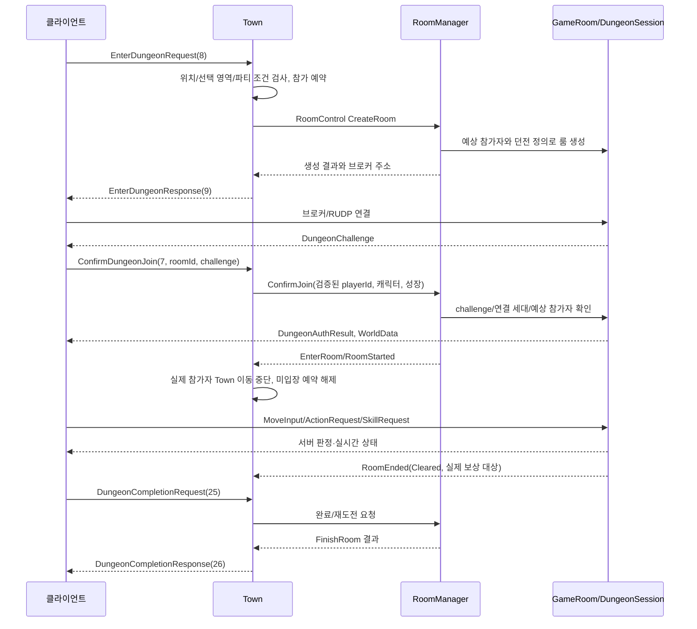

# TownServer 콘텐츠 및 패킷 개발 가이드

이 문서는 TownServer에 거래, 파티, 채팅 같은 마을 콘텐츠를 추가하고 해당 콘텐츠의
TCP 패킷을 클라이언트까지 연결하는 방법을 설명한다. 10~13절은 현재 인증·던전 입장과
런타임 구조를 설명한다. 2026-10-06 소스를 기준으로 하며 이번 문서 작업은 정적 대조만 수행했다.

## 1. 현재 책임 구분

| 구성 요소 | 책임 | 콘텐츠 코드를 둘 수 있는가 |
| --- | --- | --- |
| `TcpSession` | 4바이트 길이 프레임, 비동기 읽기·쓰기, 송신 큐 | 아니요 |
| `PlayerSession` | 패킷 파싱, 형식·접속 상태 검증, 콘텐츠 라우팅 | 최소한의 검증만 |
| `Player` | 네트워크와 무관한 플레이어 상태 | 개인 상태에 적합 |
| `TownInstance` | 플레이어·마을 공유 상태와 authoritative 처리 | 콘텐츠 진입점에 적합 |
| 별도 도메인 클래스 | 거래, 파티 등 독립 규칙과 상태 | 복잡한 콘텐츠에 권장 |
| `TownMap` | 불변 맵 데이터와 이동 판정 | 맵 관련 규칙만 |
| `DungeonCatalog` | 던전 그룹과 클라이언트 표시용 메타데이터 | 던전 목록만 |
| `Protocol` | 바이트 직렬화·역직렬화 | 콘텐츠 규칙 금지 |

`PlayerSession`이 `Player`를 상속하지 않는 현재 has-a 구조를 유지한다. 네트워크 연결의
수명과 게임 플레이어의 상태·규칙은 서로 다른 책임이다.

## 2. 콘텐츠를 추가하는 순서

거래 요청을 예로 들면 다음 순서로 진행한다.

### 2.1 규칙과 authoritative 주체 정의

코드를 작성하기 전에 아래 항목을 먼저 결정한다.

- 거래를 시작할 수 있는 플레이어 상태
- 대상 플레이어가 같은 마을에 있고 보이는 상태여야 하는지
- 동시 거래 요청과 중복 수락을 어떻게 처리할지
- 취소, 연결 종료, 시간 초과 시 상태를 어떻게 정리할지
- 아이템·재화의 최종 소유권을 어느 서버가 판정할지
- 동일 요청이 재전송되었을 때 중복 처리되지 않도록 할 방법

### 2.2 상태의 위치 결정

- 플레이어 개인 상태: `Player`에 추가한다.
- 두 명 이상이 공유하는 짧은 상태: `TownInstance`가 소유한다.
- 규칙과 상태가 커지는 콘텐츠: `TradeManager`, `PartyManager` 같은 별도 클래스를 만들고
  `TownInstance`가 has-a 관계로 소유한다.
- DB나 외부 서비스 접근: 별도 비동기 서비스에 위임한다.

빠른 초기 구현에서는 `TownInstance`에 진입점을 추가할 수 있지만, 하나의 콘텐츠가 여러
상태와 명령을 가지기 시작하면 별도 도메인 클래스로 분리한다.

### 2.3 TownInstance 진입점 추가

공개 함수는 어느 I/O 스레드에서도 호출될 수 있으므로 반드시 town strand로 전달한다.

```cpp
void TownInstance::RequestTrade(const std::uint64_t inSessionId,
    const TownProtocol::TradeRequest inRequest)
{
    const std::shared_ptr<TownInstance> self = shared_from_this();
    asio::dispatch(strand, [self, inSessionId, inRequest]()
    {
        self->RequestTradeOnStrand(inSessionId, inRequest);
    });
}
```

`RequestTradeOnStrand()`에서 수행할 작업은 다음과 같다.

1. `sessionToPlayer`로 요청자를 찾는다.
2. 요청자와 대상 플레이어가 여전히 존재하는지 확인한다.
3. 거리, 현재 거래 상태, 차단 상태 같은 콘텐츠 조건을 검증한다.
4. 서버 상태를 변경한다.
5. 관련 플레이어에게 결과 패킷을 보낸다.

`players`, `sectors`, 콘텐츠 관리자 같은 town 공유 상태는 strand 밖에서 직접 접근하면 안 된다.

### 2.4 세션에서 검증하고 라우팅

`PlayerSession::HandlePacket()`에는 다음 역할만 둔다.

- 패킷 디코딩 성공 여부 확인
- 입장 완료 여부 확인
- 문자열 길이, 수량, 열거형 범위 같은 저비용 형식 검증
- `TownInstance`의 콘텐츠 진입점 호출

대상 플레이어 존재 여부, 거래 가능 여부처럼 공유 상태가 필요한 검증은 `TownInstance`의
strand 안에서 수행한다.

### 2.5 연결 종료 처리

`TownInstance::LeaveOnStrand()`에서 해당 플레이어가 참여 중인 거래·파티·초대 상태를
정리한다. 양쪽 플레이어가 공유하는 상태라면 상대에게 취소 또는 탈퇴 결과도 전송한다.

## 3. 스레드 안전성 규칙

- `TcpSession` 송신 큐는 각 소켓 executor에서 직렬화된다.
- 마을 공유 상태는 `TownInstance::strand`에서만 읽고 수정한다.
- 콘텐츠 관리자도 `TownInstance` strand에서만 호출한다면 별도 mutex가 필요 없다.
- DB, HTTP, 파일 I/O처럼 오래 걸리는 작업을 strand에서 동기 호출하지 않는다.
- 외부 비동기 작업의 결과는 다시 `asio::dispatch(strand, ...)`로 돌아온 뒤 적용한다.
- 비동기 작업 동안 `Player&`나 컨테이너 iterator를 보관하지 않는다. 완료 시 ID로 다시 찾는다.
- 클라이언트가 보낸 플레이어 ID, 가격, 수량, 상태를 신뢰하지 않는다.

strand에서 블로킹 작업을 실행하면 모든 플레이어의 이동과 콘텐츠 처리가 함께 멈춘다.

## 4. 현재 패킷 형식

TCP 스트림은 다음 구조를 사용한다.

```text
[uint32 bodySize, big-endian][packet body]
packet body = [uint16 packetType, big-endian][payload]
```

현재 패킷 ID는 다음과 같다.

| ID | 패킷 | 방향 |
| ---: | --- | --- |
| 1 | `EnterTownRequest` | Client → Server |
| 2 | `EnterTownResponse` | Server → Client |
| 3 | `MoveInput` | Client → Server |
| 4 | `PlayerAppear` | Server → Client |
| 5 | `PlayerMove` | Server → Client |
| 6 | `PlayerDisappear` | Server → Client |
| 7 | `ConfirmDungeonJoin` | Client → Server |
| 8 | `EnterDungeonRequest` | Client → Server |
| 9 | `EnterDungeonResponse` | Server → Client |
| 10 | `MapChanged` | Server → Client |
| 11 | `DungeonSelectionOpen` | Server → Client |
| 12 | `PartyInviteRequest` | Client → Server |
| 13 | `PartyInviteAnswer` | Client → Server |
| 14 | `PartyLeaveRequest` | Client → Server |
| 15 | `PartyKickRequest` | Client → Server |
| 16 | `PartyInvitation` | Server → Client |
| 17 | `PartySnapshot` | Server → Client |
| 18 | `PartyOperationResult` | Server → Client |
| 19 | `PartySettingsRequest` | Client → Server |
| 20 | `PartyDirectoryPageRequest` | Client → Server |
| 21 | `PartyDirectoryUnsubscribe` | Client → Server |
| 22 | `PartyDirectoryPage` | Server → Client |
| 23 | `PartyDirectoryChanged` | Server → Client |
| 24 | `PartyCreateRequest` | Client → Server |
| 25 | `DungeonCompletionRequest` | Client → Server |
| 26 | `DungeonCompletionResponse` | Server → Client |
| 27 | `SkillStateRequest` | Client → Server |
| 28 | `LearnSkillRequest` | Client → Server |
| 29 | `SkillStateResponse` | Server → Client |
| 30 | `PartyDetailRequest` | Client → Server |
| 31 | `PartyDetailResponse` | Server → Client |
| 32 | `PartyJoinRequest` | Client → Server |
| 33 | `PartyJoinAnswer` | Client → Server |
| 34 | `PartyJoinRequestUpdate` | Server → Client |
| 35 | `PartyKicked` | Server → Client |
| 36 | `AdmissionTicketRequest` | Client → Server |
| 37 | `AdmissionResult` | Server → Client |

`TownMap*.json` 버전 3은 `entryPoints`와 `transitionZones`를 포함한다. `MapTransfer`는
대상 `mapId`/`entryPointId`로 이동하고, `DungeonSelection`은 `DungeonCatalog.json`의
`groupId`를 열어 준다. 영역 진입 판정과 맵 이동은 `TownInstance` strand에서 직렬화한다.

패킷 body 상한은 1MiB다. 서버 송신 대기열 상한은 4MiB이며, 상한을 초과하는 세션은
정상적인 서비스가 불가능한 상태로 취급한다.

직렬화 규칙:

- 정수는 big-endian으로 기록한다.
- `bool`은 `uint8`의 0 또는 1로 기록한다.
- `float`은 IEEE 754 비트를 `uint32`로 변환한 뒤 big-endian으로 기록한다.
- 문자열은 `[uint16 byteLength][UTF-8 bytes]` 형식이다.
- C++ 구조체 메모리를 그대로 전송하지 않는다. 패딩과 ABI가 플랫폼마다 다르다.
- 디코더는 모든 필드를 읽은 뒤 `Finished()`로 여분 바이트가 없는지 검사한다.

## 5. 새 패킷 추가 절차

현재 서버와 클라이언트는 `Protocol`을 별도로 보유한다. 두 파일의 패킷 ID, 필드 순서,
자료형은 반드시 동일해야 한다. 일치하지 않으면 해당 연결은 malformed packet으로 종료된다.

거래 요청과 결과를 추가한다고 가정한다. 아래 Trade 패킷은 미구현 예시이며 현재 마지막
ID 37 다음의 38/39를 예시로 사용한다. 실제 추가 시 YAML 정의와 양쪽 생성 헤더를 함께 맞춘다.

### 5.1 패킷 ID와 데이터 정의

기존 ID를 재사용하거나 중간 값을 바꾸지 말고 마지막 번호 뒤에 추가한다.

```cpp
enum class PacketType : std::uint16_t
{
    // 기존 값 유지
    TradeRequest = 38,
    TradeResult = 39
};

struct TradeRequest
{
    std::uint32_t requestId{};
    std::uint64_t targetPlayerId{};
};

struct TradeResult
{
    std::uint32_t requestId{};
    std::uint8_t resultCode{};
};
```

`requestId`는 클라이언트가 응답을 자신의 요청과 대응시키는 값이다. 재화 변경처럼 중복
실행이 위험한 명령에는 서버 측 중복 요청 방지도 함께 설계한다.

### 5.2 서버 Protocol 수정

`Protocol.h`에 구조체와 필요한 함수 선언을 추가한다.

```cpp
std::vector<std::uint8_t> Encode(const TradeResult& inPacket);
std::optional<TradeRequest> DecodeTradeRequest(
    const std::vector<std::uint8_t>& inPacket);
```

`Protocol.cpp`에서는 필드를 선언 순서대로 기록하고 정확히 같은 순서로 읽는다.

```cpp
std::vector<std::uint8_t> Encode(const TradeResult& inPacket)
{
    PacketWriter writer(PacketType::TradeResult);
    writer.WriteUInt32(inPacket.requestId);
    writer.WriteUInt8(inPacket.resultCode);
    return writer.Finish();
}
```

디코더는 예상 타입, 모든 필드, 값 범위, `Finished()`를 확인한다.

### 5.3 서버 수신 라우팅

`PlayerSession::HandlePacket()`의 switch에 C2S 패킷 case를 추가한다.

```cpp
case TownProtocol::PacketType::TradeRequest:
{
    const auto request = TownProtocol::DecodeTradeRequest(inPacket);
    if (!request.has_value() || !enterRequested)
    {
        tcpSession->Stop();
        return;
    }
    town->RequestTrade(GetSessionId(), *request);
    return;
}
```

패킷 형식 오류는 연결을 종료한다. 콘텐츠 조건 불충족은 연결 오류가 아니므로
`TradeResult`에 명시적인 실패 코드를 담아 응답한다.

### 5.4 클라이언트 Protocol 수정

클라이언트 `Network/TownProtocol.h/.cpp`에 서버와 동일한 enum 값과 구조체를 추가한다.

- C2S 요청: `Encode(const TradeRequest&)`
- S2C 결과: `DecodeTradeResult(...)`

서버와 클라이언트의 필드 순서가 동일한지 나란히 확인한다.

### 5.5 클라이언트 송수신 연결

`TownClient`에 `SendTradeRequest()`를 추가하고 `SendMovement()`와 동일하게 network strand에
post한 뒤 `QueuePacket()`을 호출한다.

S2C 결과는 다음 세 곳에 등록한다.

1. `TownClient::HandlePacket()` switch에서 디코딩한다.
2. `TownEvent` variant에 `TradeResult`를 추가한다.
3. `GameWorld::ProcessNetworkEvents()` 또는 별도 UI/controller가 이벤트를 처리한다.

네트워크 스레드에서 게임 오브젝트를 직접 수정하지 않는다. `TownClient`가 mutex로 보호된
이벤트 큐에 넣고 게임 스레드가 `ConsumeEvents()`로 가져가는 현재 흐름을 유지한다.

## 6. 호환성 정책

현재 프로토콜은 서버와 클라이언트를 함께 배포하는 lockstep 방식이다. 패킷 구조가 다른
구버전 클라이언트는 연결이 종료될 수 있다.

서버와 클라이언트를 독립 배포해야 한다면 콘텐츠 추가 전에 다음을 도입한다.

- 입장 요청의 `protocolVersion`
- 서버가 지원하는 최소·최대 버전
- 호환되지 않는 버전을 설명하는 입장 실패 패킷

필드를 기존 패킷 중간에 삽입하는 대신 새 패킷 ID 또는 새 버전 패킷을 추가하는 편이 안전하다.

## 7. 검증 체크리스트

아래는 기능 변경 후 사용할 검증 절차다. 이번 문서 작업에서 이 절차를 실행했다는 의미가 아니다.

### 패킷 단위 검증

- encode 후 decode한 값이 원본과 같은가
- 문자열 길이 0, 최대값, 초과값을 처리하는가
- 잘린 body와 여분 바이트를 거부하는가
- 잘못된 enum, bool, 수량, 플레이어 ID를 거부하는가
- 1MiB body 상한을 넘는 패킷을 거부하는가

### 콘텐츠 검증

- 입장 전 요청을 거부하는가
- 존재하지 않거나 퇴장한 플레이어를 안전하게 처리하는가
- 같은 요청이 동시에 들어와도 상태가 한 번만 변경되는가
- 요청 도중 연결이 끊어지면 공유 상태가 정리되는가
- 실패가 세션 종료가 아닌 명시적 결과 패킷으로 전달되는가
- DB 응답이 늦어져도 이동 tick이 멈추지 않는가

### 통합 검증

1. 서버와 클라이언트 Debug/Release를 빌드한다.
2. 클라이언트 두 개 이상을 연결한다.
3. 정상 요청과 거절 요청을 각각 보낸다.
4. 요청 중 한 클라이언트를 종료한다.
5. 재접속 후 이전 임시 상태가 남지 않았는지 확인한다.

## 8. 관련 파일

- `Protocol.h/.cpp`: 서버 패킷 정의와 직렬화
- `PlayerSession.h/.cpp`: C2S 검증과 라우팅
- `TownInstance.h/.cpp`: authoritative 콘텐츠 처리와 공유 상태
- `TownMap.h/.cpp`: 맵 데이터, 이동 판정, 진입 영역 검색
- `DungeonCatalog.h/.cpp`: 던전 그룹과 선택창 메타데이터
- `Data/TownMap*.json`: 맵·도착 지점·전환 영역
- `Data/DungeonCatalog.json`: 던전 그룹과 표시 정보
- `Player.h/.cpp`: 네트워크 비종속 플레이어 상태
- `../Shared/TcpSession.h/.cpp`: TCP framing·TLS·비동기 송수신
- `../Shared/NetworkConstants.h`: body 및 송신 큐 상한
- `NetworkConstants.h`: 타운 기본 포트·I/O 스레드 수

## 9. ODBC 저장 프로시저 실행

`../Shared/Database/OdbcDatabase`는 각 서버 프로세스 안에서 DB 전용 작업 큐와 커넥션 풀을 운영한다.
`TownInstance::RunStoreProcedure()`로 실행하면 완료 콜백이 town strand에서 호출된다.
DB worker의 입력 바인딩·결과 매핑에서는 마을 상태를 접근하지 않는다.

### 연결과 실행 범위

- 프로세스 환경 변수 `ACTIONRPG_DB_CONNECTION_STRING`으로 ODBC 연결 문자열을 전달한다.
  비밀정보를 소스·설정 사본·로그·명령 인자에 남기지 않는다. 실행 환경에 대상 DB용
  ODBC 드라이버가 필요하며 드라이버와 서버 프로그램의 32/64비트 구성이 일치해야 한다.
- 변수가 없으면 DB 기능이 비활성화되고 기존 마을 기능은 유지된다. DB 요청에는
  `NotConfigured` 오류가 비동기로 반환된다. 이는 Town의 일반 DB 모듈에 대한 설명이다.
  클라이언트 입장은 별도 Auth의 계정 DB 검증·소비 승인이 반드시 필요하며 인증 우회는 없다.
- 연결은 첫 요청에서 생성하고 worker별로 유지한다. 기본 연결 수 2, 대기 요청 상한 128,
  큐 대기 제한 30초, 연결 제한 5초, statement 제한 10초다. 값은 `DatabaseOptions`에서 지정한다.
- 연결 실패나 실행·매핑 오류 후 해당 연결을 폐기한다. 다음 새 요청에서 다시 연결하며,
  실패한 요청 자체를 자동 재실행하지 않는다. 경고·잘림·타임아웃 옵션 대체도 오류로 취급한다.
- 연결·query 타임아웃을 설정하고 확인할 수 있는 드라이버가 필요하다. 타임아웃의 실제
  적용 범위는 드라이버별로 검증해야 한다. 이 설정은 전체 작업의 강제 종료 시각을 보장하지 않는다.
- `Stop()`은 새 요청을 거절하고 접수된 요청을 처리한다. 큐에서 만료된 요청은 실행하지 않는다.
  소멸자는 worker 종료를 기다리므로 town strand에서 서비스 소멸자를 실행하지 않는다.
  완료 executor의 work guard는 접수·거절된 요청의 콜백 전달까지 I/O context가 종료되는 것을 막는다.

### Req/Res와 사용 예시

실행 클래스는 `IStoreProcedure<Req, Res>`를 상속하고 아래 세 함수를 정의한다.

| 함수 | 역할 |
|---|---|
| `GetName()` | 고정된 프로시저 이름 반환. 영문·숫자·밑줄과 점으로 구분한 한정 이름만 허용 |
| `BindParameters()` | 프로시저 선언 순서대로 IN/OUT/INOUT 값 등록 |
| `ReadRow()` | 각 결과 행을 Res로 매핑. 결과 인덱스는 컬럼이 있는 결과 집합 기준 0부터 시작 |
| `ValidateResults()` | 선택적 재정의. 빈 결과셋까지 포함한 결과셋·전체 행 개수와 Res를 커밋 전에 검사 |

입력값은 `AddInput()`으로 등록한다. OUT/INOUT은 Res의 `std::optional<T>` 멤버를
`AddOutput()`/`AddInputOutput()`에 등록한다. INOUT 초기값이 Req에 있으면 먼저 Res에 복사한다.
OUT/INOUT의 대상 멤버는 결과 매핑 중에도 같은 위치에 유지한다. 매핑하면서 재할당할
컨테이너 요소를 출력 파라미터 대상으로 등록하지 않는다.
지원 타입은 `int32_t`, `uint32_t`, `int64_t`, `uint64_t`, `double`, `bool`, `wstring`과 그 optional이다.
문자열은 ODBC Unicode API를 사용한다. 바이너리·날짜·정밀 소수 등은 실제 필요 시 별도 계약을 추가한다.

다음은 **사용 형태를 설명하는 예시**다. `EchoProcedure`나 DB 프로시저를 자동 생성·등록·실행하지 않는다.
이름과 파라미터·결과 형태가 일치하는 실제 저장 프로시저가 먼저 있어야 한다.

```cpp
namespace Db = ActionRPG::Database;

struct EchoReq
{
    std::int32_t value{};
    std::wstring text;
};

struct EchoRow
{
    std::optional<std::int32_t> value;
    std::optional<std::wstring> text;
};

struct EchoRes
{
    std::vector<EchoRow> rows;
};

class EchoProcedure final : public Db::IStoreProcedure<EchoReq, EchoRes>
{
public:
    std::wstring_view GetName() const noexcept override { return L"EchoProcedure"; }

    void BindParameters(Db::ProcedureParameters& inParameters, EchoRes&) const override
    {
        inParameters.AddInput(req.value);
        inParameters.AddInput(req.text);
    }

    void ReadRow(Db::ProcedureRow& inRow, std::size_t inResultIndex, EchoRes& outResponse) const override
    {
        if (inResultIndex != 0 || inRow.GetColumnCount() != 2)
            throw Db::DatabaseException({ Db::DatabaseErrorCode::InvalidResult, "Unexpected echo result." });
        outResponse.rows.push_back({ inRow.Read<std::int32_t>(1), inRow.Read<std::wstring>(2) });
    }
};

// townInstance is the existing shared_ptr<TownInstance>.
auto procedure = std::make_unique<EchoProcedure>();
procedure->req.value = 123;
procedure->req.text = L"hello";
townInstance->RunStoreProcedure(std::move(procedure),
    [](TownServer::Domain::TownInstance& inTown, Db::ProcedureResult<EchoRes> inResult)
    {
        if (!inResult.IsSuccess())
        {
            // Inspect inResult.error. An uncertain execution must not be retried blindly.
            return;
        }
        // Use inResult.response->rows on the town strand.
        // Re-find the target by persistent ID/session ID and validate its current state before applying.
    });
```

`Run()`에 `unique_ptr`를 넘긴 뒤에는 객체나 멤버의 별도 포인터로 수정하지 않는다.
콜백은 예외를 던지지 않아야 하며, 호출자 executor/context는 완료까지 살아 있어야 한다.
town 객체가 이미 소멸했다면 `RunStoreProcedure()`는 게임 상태 콜백을 호출하지 않는다.
여러 요청은 worker 간에 실행 순서가 바뀔 수 있다. 같은 캐릭터의 연속 변경은 콘텐츠에서
이전 결과를 기다리거나 DB의 조건부 갱신·버전·제약으로 충돌을 검증한다.

### 트랜잭션·결과·마이그레이션

- 한 객체의 CALL 전체를 같은 연결·트랜잭션에서 처리한다. 모든 결과와 OUT 값의 처리가 끝나고
  커밋이 확인된 후 성공 Res를 반환한다. 출력 파라미터만 반환하는 프로시저도 지원한다.
  `IsSuccess()`는 호출·결과 처리·커밋의 성공을 뜻한다. 게임 규칙의 승인 여부나 필수 결과 행의
  존재 여부는 해당 프로시저의 Res를 통해 콘텐츠에서 확인한다.
- 프로시저는 내부 COMMIT/전체 ROLLBACK·DDL·세션 설정 변경을 하지 않는 계약을 따른다.
  합의된 savepoint 부분 롤백은 외부 트랜잭션을 종료하지 않는 범위에서만 사용한다.
  ODBC는 DBMS별 트랜잭션 의미를 통일하지 않는다. 대상 DBMS의 트랜잭션 지원, 테이블 엔진,
  프로시저 구현과 드라이버를 확인해야 한다. 트랜잭션 밖 외부 효과는 자동 복구되지 않는다.
- 결과 컬럼은 1부터 증가하는 순서로 한 번씩 읽는다. NULL은 optional로 구분하고,
  컬럼 타입 불일치·값 범위 초과·잘린 문자열을 성공으로 처리하지 않는다.
- 문자열당 32768 UTF-16 코드 단위, 전체 행 4096, 결과 집합 16, 읽은 결과 값 4MiB를 제한한다.
  큰 목록은 프로시저의 페이지 단위 조회로 처리한다.
- 오류는 고정된 문맥, SQLSTATE, native code, `executionMayHaveOccurred`로 전달한다.
  driver 원문 오류 메시지는 접속 정보나 SQL 값을 포함할 수 있어 전달·출력하지 않는다.
- ODBC 모듈 자체는 스키마/프로시저를 생성하거나 적용하지 않는다. Google 로그인의
  대상 DBMS·논리 계약·SQL 파일은 아래 10절을 따른다. 수동 Up/Down 도구와 Auth의
  기동 적용 이력·실제 스키마 검증은 구현되어 있다. 실제 DB 적용·운영 검증은 별도 절차다.
- 프로시저·스키마 변경은 [공통 DB 규칙](../../docs/workflows/DATABASE_MIGRATIONS.md)을 따라
  반드시 버전 파일로 관리한다.
  적용된 파일은 불변이며, 마을 서버가 기동하면서 마이그레이션을 자동 적용하지 않는다.

## 10. AuthServer 분리와 타운 입장

Google ID 토큰 검증과 `login_google_account` 계정 조회는 별도 AuthServer가 담당한다.
[Auth API 및 실행 계약](../AuthServer/DEVELOPMENT.md)을 따른다. TownServer의 공통 ODBC
실행기는 유지하지만 로그인 계정 프로시저와 Google 인증 증명을 소유하지 않는다.

타운 클라이언트 TCP는 TLS 1.2 이상이 필수다. `ACTIONRPG_TOWN_TLS_CERT`,
`ACTIONRPG_TOWN_TLS_KEY`, `ACTIONRPG_AUTH_HOST`, `ACTIONRPG_AUTH_CA_FILE`,
`ACTIONRPG_TOWN_ID`, `ACTIONRPG_TOWN_AUTH_KEY`가 필요하다. TLS 설정이 없으면
시작에 실패하며, 평문 입장이나 게스트 입장으로 우회하지 않는다.

클라이언트는 Auth HTTPS에서 목적 타운 ID가 지정된 30초 단일 사용 티켓을 받은 뒤,
TLS 타운 연결의 첫 패킷으로 `AdmissionTicketRequest(36)`을 전송한다.
타운은 Auth 내부 HTTPS `/internal/consume` 승인으로만 계정 ID를 설정하고
`AdmissionResult(37, result=0)`을 응답한다. 이후 기존 `EnterTownRequest(1)`을 보낸다.
계정 ID나 Google ID 토큰을 타운 패킷으로 제출하지 않는다.
기존 패킷 ID 1~35는 유지하며 새 패킷은 YAML 마지막에 추가했다. 클라이언트의 헤더·
로그인/TLS 연결은 별도 클라이언트 담당 소스에 구현 경로가 있다. 실제 설정과 사용 절차는
[클라이언트 문서](../../../ActionRPGClient/ActionRPGClient/README.md)를 따른다.
현재 소스의 존재를 실제 인증 왕복 검증 완료로 간주하지 않는다.

36의 payload는 64자리 소문자 hex ticket 문자열이며 body는 타입 2바이트 + 문자열 길이
2바이트 + 값 64바이트로 총 68바이트다. 37은 타입 2바이트 + result 1바이트로 총 3바이트다.
둘 다 앞에 별도 uint32 body 길이가 붙는다. 현재 서버는 성공 result=0만 보내며 인증 거절은
연결 종료로 나타난다. 클라이언트가 종료만 보고 정지/중복/만료 중 특정 원인을 확정할 수 없다.

Auth HTTP 작업은 제한된 별도 worker에서 처리하며 town strand를 막지 않는다.
15초 권한을 5초 주기로 갱신하고 권한 만료/갱신 실패/새 로그인/타운 이동 시 연결을 종료한다.
늦은 응답은 요청 시작 시각과 세션 시도 ID로 검사한다. 타운 계정 ID 조회는 로컬 만료를
확인하므로 완료 콜백 대기로 권한을 연장하지 않는다.

연결 종료 시 타운 객체를 제거한다. 던전 참여 또는 입장 예약이 있었다면 RoomServer의
멤버 제거/부재 확인 응답 이후 Auth 소유권을 해제한다. RoomControl 연결 단절을 퇴장
확인으로 간주하지 않는다. 퇴장 확인 또는 Auth 해제 응답을 잃으면 새 타운 입장을 차단한다.
재시도와 캐릭터 진행 상태 이관은 구현하지 않았다. 관련 운영 제한은 Auth 문서를 따른다.

Auth 기동 시 실제 DB 적용 이력·체크섬·구조 검증에 실패하면 로그인/입장을 503으로 차단한다.
[DB 마이그레이션 규칙](../../docs/workflows/DATABASE_MIGRATIONS.md)의 수동 Up/Down을
사용하며 관련 서비스 종료 → Up → 동일 SQL 배포 → Auth 검증 기동 → 타운/룸 기동 순서를 따른다.
이번 문서 작업에서 빌드, 테스트, 서버 실행, 패키지 설치, 실제 DB/Google 요청은 수행하지 않았다.

## 11. 기동·인증된 플레이어의 수명

`main.cpp`는 인자와 환경을 검사하고 실행 파일 기준 Data의 맵·던전 목록·성장/스킬 정의를
읽는다. 하나의 io_context에 TownInstance, 클라이언트 TLS acceptor, loopback RoomControl
acceptor를 연결하고 지정한 I/O 스레드가 실행한다. 공유 상태의 권위는 TownInstance strand다.

| 단계 | 현재 실행 경로 | 거절/종료 조건 |
|---|---|---|
| TCP/TLS 연결 | TownClientTcpServer → Shared/TcpSession | TLS 설정/handshake 실패, 10초 handshake 제한 |
| 인증 전 | PlayerSession::HandlePacket → AdmissionTicketRequest | 인증 전 다른 게임 패킷, malformed, 중복 인증 시도 |
| Auth 소비 중 | TownInstance::Admit → AuthControlClient | 10초 admission 제한, 과다 대기, Auth 거절/timeout |
| 인증 완료 | 계정 ID·lease/local deadline 설정, 패킷 37 | 지연 결과의 이전 시도/종료 세션은 적용하지 않음 |
| 마을 입장 | EnterTownRequest → EnterOnStrand | 미인증, 이미 입장 요청, 존재하지 않는 캐릭터 정의 |
| 게임 중 | 마을 이동·파티·스킬·던전 요청 | 계정 local deadline 만료 시 이후 게임 요청 차단 |
| 연결 종료 | Disconnect → CloseAuth → TownInstance::Leave | 던전/예약 정리 확인 후 Auth release |

PlayerSession은 Unauthenticated → ResolvingAccount → Authenticated → Closed 상태를
갖는다. ResolvingAccount는 현재 Auth HTTPS 승인을 기다리는 상태 이름이며 Town이 Google
로그인 프로시저를 직접 실행한다는 뜻이 아니다. 계정 ID는 클라이언트 EnterTown 입력이 아니라
Auth consume 응답에서만 설정한다.

새 EnterTown은 Town의 nextPlayerId로 ID를 발급하고 선택 캐릭터의 기본 성장 상태를 만든다.
기본 맵의 spawn에 배치하여 EnterTownResponse, 가시성 갱신, 스킬 상태를 보낸다.
`Character<characterId>` 정의가 있어야 하지만 DB의 캐릭터 소유권 조회/복원은 없다.
연결이 새로 입장할 때 이전 레벨·SP·습득 스킬을 저장 데이터에서 불러오지 않는다.

### Auth 대기와 만료

AuthControlClient의 별도 worker 2개와 pending 상한 64개가 HTTPS를 수행하고, 완료를
호출자 executor로 post한다. work guard가 완료 전달까지 io_context 수명을 유지한다.
인증서 CA/호스트명을 검증하며 리다이렉트를 허용하지 않는다. 연결/읽기/쓰기 timeout은
각각 3초다. 결과가 불명확한 consume/renew/release를 자동 재전송하지 않는다.

Town의 admission 레코드는 활성 연결을 포함해 최대 10000개이고 1초 주기로 만료/갱신을 확인한다.
15초 lease의 local deadline은 요청 시작 시각을 기준으로 설정하며 응답이 늦게 왔다고
응답 수신 시각부터 새 15초를 더하지 않는다. 세션 시도 ID, 연결 상태, 현재 admission 상태를
함께 확인한다. 갱신은 5초 주기이며 실패/만료 시 TLS 연결을 종료한다. 새 로그인 통보 push는 없다.

### 종료와 소유권 해제

클라이언트 TCP 종료만으로 Room의 플레이어가 제거되었다고 판단하지 않는다. 타운에 던전
참여/예약이 있으면 RoomControl LeaveRoom을 요청하고 멤버 제거 또는 부재 확인을 기다린다.
확인 후 해당 lease/connection을 Auth release에 제출한다. 응답이 없거나 RoomControl이
끊기면 소유권을 자동 해제하지 않는다. RoomControl 장애 시 관련 세션을 종료하면서 기존
룸 관계를 보존하여 종료 확인을 우회하지 않는다. 자동 복구/재연결은 구현하지 않았다.

## 12. 던전 생성·입장·전투·복귀



생성 전 Town은 요청한 zoneId가 플레이어의 실제 위치에서 열리는 DungeonSelection 영역인지,
그 그룹에서 dungeonId를 선택할 수 있는지 검사한다. 이미 룸에 있거나 예약 중이면 거절한다.
파티는 리더와 진행 중 요청/참가자 상태를 검증한다. 클라이언트가 보고한 UID·위치로 참가를 승인하지 않는다.

RoomControl은 등록된 룸 서버의 용량과 현재 룸 수를 보고 가능한 서버를 선택한다. 생성 응답은
requestId와 해당 룸 서버를 대조한다. 룸 ID는 상위 32비트의 roomServerId와 하위 생성 번호로
구성된다. 현재 단일 타운 안의 등록/예약 관리이며 전역 분산 룸 디렉터리가 아니다.

ConfirmDungeonJoin은 현재 세션의 playerId와 예약 roomId를 대조한다. 캐릭터/성장 상태도
서버 보유 값을 Room에 전달한다. RoomManager는 challenge로 대기 DungeonSession을 찾고
연결 세대와 예상 참가 여부를 검사한다. 다른 연결의 늦은 확인으로 새 연결을 인증하지 않는다.
GameRoomServer가 Google ID 토큰이나 Auth gameToken을 다시 검증하는 흐름은 없다.

GameRoom 상태는 WaitingForPlayers → Running → Cleared/Stopped다. 참가자가 모두 들어오면
시작하며, 30초 입장 제한 시점에는 실제 입장자를 기준으로 시작한다. 아무도 없으면 중단한다.
월드 초기 데이터 전송이 완료되기 전에는 게임 요청/실시간 상태를 허용하지 않는다.

Room의 몬스터는 생성 때 한 번 배치한다. 현재 방에 살아 있는 몬스터가 없으면 게이트 이동을
허용하고, 같은 룸에서 처치한 몬스터는 재방문해도 부활하지 않는다. 보스 처치 클리어 순간의
잔류 플레이어가 보상 대상이며 현재는 대상 전달/로그까지다. 실제 지급/인벤토리 저장은 없다.
재도전은 새 룸 생성 성공 후 이전 룸을 정리하며 새 몬스터 상태로 시작한다.

정상 복귀/재도전은 실제 참가자 집합과 완료 상태를 검증한다. 클리어 뒤 바로 타운 상태로
전환하는 대신 완료 요청/응답 흐름을 사용한다. 상세 전투 메시지·스킬 판정은
[전투 계약](../GameRoomServer/COMBAT_PROTOCOL.md), [스킬 계약](../GameRoomServer/PLAYER_SKILLS.md)을 따른다.

## 13. 실행 경계·스레드·확장 위치

| 상태/작업 | 실행 경계 | 주의할 점 |
|---|---|---|
| acceptor·서버 세션 목록 | Shared/TcpAcceptServer strand | 닫힘 콜백으로 서버의 세션 제거 |
| 세션 프레이밍·송신 큐 | 연결별 socket executor/strand | async_write 버퍼 수명·송신 순서 유지 |
| 마을 플레이어·파티·예약·스킬 | TownInstance strand | 별도 worker에서 컨테이너/Player를 직접 접근하지 않음 |
| Auth HTTPS | AuthControlClient worker → Town strand | 완료 시 시도/현재 상태/deadline 재검사 |
| ODBC | DB worker → 요청한 executor | 결과 커밋 후 현재 플레이어를 ID로 다시 조회 |
| 룸 목록·challenge 대기 | RoomManager strand | Room 연결의 generation 대조 |
| 룸 이동·AI·전투 | 각 GameRoom strand | 룸 안 상태를 전투 tick과 함께 직렬화 |
| RUDP callbacks·연결/스트림 바인딩 | DungeonSession 동기화 → 룸/관리자 post | 바인딩 mutex와 세대/weak stream lease 유지 |

Town은 50ms tick(20Hz)과 매 2tick 상태 전송(10Hz)을 사용한다. 실제 경과 시간은 최대
0.25초로 제한하며 500ms 동안 새 이동 입력이 없으면 멈춘다. 룸 참가자는 Town 이동 계산에서
제외된다. Room은 1/30초 고정 전투 tick과 15Hz 실시간 전송을 사용하며, 늦은 tick을 무제한
따라잡지 않는다. Room 이동 입력 제한은 1초다. 이는 서로 다른 서버의 규칙이다.

TCP body 1MiB와 송신 대기 4MiB 상한은 Shared/NetworkConstants에 있다. Room 월드는
총 4MiB 이내 분할 전송이며 실시간 프레임/대역폭 한도는 별도 전투 계약을 따른다.
I/O 스레드 수를 늘려도 하나의 TownInstance나 GameRoom 공유 상태를 동시에 수정하지 않는다.
strand의 동기 DB/HTTPS 호출이나 큰 파일 처리로 서버 업데이트를 막지 않도록 변경한다.

| 파일 | 런타임 책임 / 수정 위치 |
|---|---|
| [main.cpp](main.cpp) | CLI, 실행 파일 기준 데이터 로딩, I/O 스레드와 서버 수명 |
| [TownClientTcpServer.cpp](TownClientTcpServer.cpp) | TLS 수신과 PlayerSession 생성/닫힘 |
| [PlayerSession.cpp](PlayerSession.cpp) | 인증 전 게이트, C2S 형식·상태 검증 |
| [TownAuthentication.cpp](TownAuthentication.cpp) | consume/renew/release, 시도와 local deadline |
| [AuthControlClient.h](Authentication/AuthControlClient.h) | Auth HTTPS worker/한도/완료 executor |
| [TownInstance.cpp](TownInstance.cpp) | 입장·이동·가시성·파티·예약·복귀·성장 상태 |
| [RoomControlTcpServer.cpp](RoomControlTcpServer.cpp) | 룸 등록·선택·생성/퇴장 확인과 응답 대응 |
| [TcpSession.cpp](../Shared/TcpSession.cpp) | 공통 framing/TLS/비동기 송신 수명 |
| [TownPacketDefine.yml](../../Tool/TownPacketDefine.yml) | 패킷 ID·필드의 정의 원본 |
| [RoomControlProtocol.h](../Shared/RoomControlProtocol.h) | Town↔Room 내부 메시지 계약 |
| [RoomManager.cpp](../GameRoomServer/RoomManager.cpp) | 룸 생성·입장 인증·종료 관리 |
| [GameRoom.cpp](../GameRoomServer/GameRoom.cpp) | tick·몬스터·전투·완료 판정 |
| [DungeonSession.cpp](../GameRoomServer/DungeonSession.cpp) | RUDP 연결 challenge, 월드/실시간 전송 |

설정·서비스 시작 순서는 [저장소 README](../../README.md)를 따른다. 캐릭터 영속 저장,
타운 간 성장 이관, 원격 RoomControl, 제어 연결 장애 복구는 현재 API/데이터 소유권 밖의
별도 설계 대상이다. 이번 문서 변경으로 이 기능을 추가하거나 실제 실행을 검증하지 않았다.
