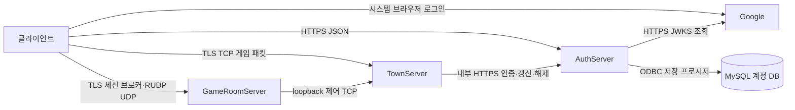

# ActionRPGServer

현재 서버는 AuthServer, TownServer, GameRoomServer의 세 프로세스로 구성된다. 이 문서는
2026-10-06 소스를 기준으로 설명하며, 문서 작성 중 빌드·실행·실제 DB/Google 요청은 수행하지 않았다.
소스 구현과 실제 환경에서의 동작 검증을 구분한다.

이 파일은 서버 저장소의 대표 진입 문서다. 처음 구성할 때는 아래 서버 구조와
[설정·실행 순서](#설정과-실행-순서)를 읽고, 작업할 영역의 상세 문서로 이동한다.
로그인 API와 검증은 [Auth 개발 계약](ActionRPGServer/AuthServer/DEVELOPMENT.md),
마을·던전 입장과 패킷 확장은 [Town 개발 가이드](ActionRPGServer/TownServer/DEVELOPMENT.md),
룸 전투는 [전투 계약](ActionRPGServer/GameRoomServer/COMBAT_PROTOCOL.md)을 따른다.

## 서버 구성과 통신



| 프로세스 | 소유 상태와 역할 | 외부 연결 |
|---|---|---|
| AuthServer | Google ID 토큰 검증, 계정 조회/첫 가입, 게임 토큰·입장 티켓·타운 소유권 | Google JWKS, MySQL; HTTPS 공개/내부 API |
| TownServer | 인증된 연결, 마을 이동·가시성, 파티·던전 예약, 접속 중 성장·스킬 | 클라이언트 TLS, Auth HTTPS, 룸 제어 TCP |
| GameRoomServer | 여러 던전 인스턴스, 입장 인원 확정, 몬스터·전투·HP·월드 전송 | MultiSocketRUDP 세션, Town 제어 TCP |
| MySQL | 계정·Google 식별자·로그인 시각 및 마이그레이션 감사 이력 | Auth의 공통 ODBC 실행기 |

하나의 Auth에 여러 타운 ID를 등록할 수 있다. 타운마다 별도 등록 키와 룸 서버 묶음을 사용한다.
Town↔Room 제어 채널은 같은 호스트의 loopback만 허용한다. 현재 구조로 룸 프로세스를 다른
호스트에 분산할 수 없다. 다중 Auth와 공유 세션 저장소는 구현하지 않았다.

## 데이터의 저장 위치와 수명

| 데이터 | 저장 위치 | 종료·재접속 시 동작 |
|---|---|---|
| 계정, 외부 provider/sub, 상태, 로그인 시각 | MySQL | DB 영속 데이터 |
| challenge, gameToken, ticket, 타운 lease/소유권 | Auth 메모리 | Auth 재시작 시 소실 |
| playerId, 위치, 파티, 레벨·SP·습득 스킬 | Town 메모리 | 새 EnterTown에서 생성; 계정별 복원/타운 간 이관 없음 |
| 룸, 몬스터 HP·AI, 전투 상태 | Room 메모리 | 같은 인스턴스 안에서 유지; 재도전은 새 룸 |
| 맵·던전·몬스터·스킬 정의 | 각 서버 실행 파일 옆 Data | 시작 시 로딩; 배포 파일 갱신 후 재시작 |
| 이미지·스프라이트 등 클라이언트 자산 | ActionRPGClient의 Assets | 서버 저장소에 복사하지 않음 |

DB의 accountId는 영속 계정 ID다. playerId는 타운 프로세스에서 발급하는 플레이어 ID이며
계정 ID와 다르다. characterId는 현재 캐릭터 정의를 고르는 값으로, DB에 저장된 소유 캐릭터
레코드가 아니다. 로그인 가능하다는 사실이 성장·아이템의 영속 저장까지 구현되었다는 뜻은 아니다.

## 로그인에서 전투까지

1. 클라이언트가 Auth의 challenge/nonce를 Google 브라우저 인증에 연결하고 ID 토큰을 받는다.
   현재 클라이언트에는 PKCE·state·loopback callback과 인증 코드 교환 경로가 있다.
2. Auth `/v1/login`이 ID 토큰을 검증하고 MySQL 계정을 조회/첫 가입한 뒤 gameToken을 발급한다.
   클라이언트는 이 토큰으로 `/v1/tickets`에서 목적 타운의 단일 사용 티켓을 받는다.
3. ready=true 티켓으로 Town TLS의 첫 패킷 36을 보낸다. Town의 Auth consume 승인을 받은
   성공 패킷 37 이후에 EnterTownRequest(1)을 보내 마을에 입장한다.
4. Town이 던전 참가자를 예약하고 룸을 생성한다. Room 연결의 challenge를 인증된 Town
   연결로 확인하고 월드를 받은 뒤 플레이한다. 이동·전투 판정과 HP 변경은 Room이 수행한다.

Google ID 토큰, Auth 게임 토큰, 타운 티켓, 타운 lease, 던전 challenge는 서로 다른 자격 정보다.
검증 위치와 종료 흐름은 [Auth 로그인 상세](ActionRPGServer/AuthServer/DEVELOPMENT.md#로그인-단계별-실행-경로) 및
[Town·던전 입장 상세](ActionRPGServer/TownServer/DEVELOPMENT.md#12-던전-생성입장전투복귀)를 따른다.

## 스레드와 업데이트 주기

Town은 이동 20Hz/상태 전송 10Hz, Room은 전투 30Hz/실시간 상태 15Hz를 목표로 한다.
공유 상태는 TownInstance와 각 GameRoom의 strand에서 직렬화하며 외부 Auth/DB 작업은
별도 worker에서 처리한다. 실제 성능 측정값은 아니며 RUDP worker frame과 전투 tick도 별개다.
스레드 경계와 요청 한도는 [Auth 런타임](ActionRPGServer/AuthServer/DEVELOPMENT.md#요청-한도와-스레드-구조),
[Town·Room 런타임](ActionRPGServer/TownServer/DEVELOPMENT.md#13-실행-경계스레드확장-위치)에 정리했다.

## 빌드 준비와 출력

Windows, Visual Studio C++ v145 도구 집합, Windows SDK, x64 및 저장소의 vcpkg manifest를
사용한다. Auth는 C++20, OpenSSL, jwt-cpp, cpp-httplib HTTPS를 사용한다.
한국어 Windows에서 CMake 3.31.10의 tar.gz 일본어 경로 추출 문제를 피하도록
Tool/vcpkg-overlay-ports/cpp-httplib이 같은 0.40.0 소스의 SHA512 검증 ZIP을 사용한다.

GameRoomServer의 MultiSocketRUDP/Logger 프로젝트 참조에는 서브모듈이 필요하다.
다음은 준비·빌드 명령의 예시이며 이번 문서 작업에서 실행하지 않았다.

```powershell
git submodule update --init External/MultiSocketRUDP
git -C External/MultiSocketRUDP submodule update --init external/CommonCode
msbuild ActionRPGServer/ActionRPGServer.slnx /m /p:Configuration=Debug /p:Platform=x64
```

Visual Studio에서도 ActionRPGServer/ActionRPGServer.slnx를 열어 Debug/Release | x64로 빌드한다.
Directory.Build.props가 GameRoomServer·MultiSocketRUDP·Logger의 출력을
artifacts/bin/x64/<Configuration>/, 중간 파일을 artifacts/obj/ 아래로 지정한다.
Auth/Town 실행 파일은 사용하는 프로젝트/솔루션 빌드의 실제 OutDir에서 확인한다.
Town/Room Data와 Room ServerOptionFile은 프로젝트 빌드에서 실행 폴더로 복사한다.
Auth의 DB 검증용 SQL 배포 디렉터리는 환경 변수로 별도 지정하며 자동 복사하지 않는다.

## 설정과 실행 순서

1. 실제 MySQL 8.0.46 대상·스키마, ODBC 드라이버·권한·접속 보안을 준비한다.
2. 관련 서비스를 종료한 상태에서 수동 Up으로 V000000 이력 기반과 V000001→000003을 준비한다.
   대상 스키마가 없으면 Up의 `-CreateDatabase` 옵션으로 DB 생성부터 수행할 수 있다.
   [DB 적용 계약](docs/workflows/DATABASE_MIGRATIONS.md)을 따른다. Auth가 SQL을 자동 적용하지 않는다.
3. 동일한 Up/Down/Infrastructure SQL을 Auth 검증 경로에 배포하고 인증서·환경 변수를 제공한다.
4. Auth를 시작하여 실제 DB 구조/이력 검증에 성공한 head=3을 확인한다. 단순 포트 개방은 준비 증거가 아니다.
5. Town을 시작하고 같은 호스트의 Room을 연결·등록한 뒤, 설정된 클라이언트로 입장한다.

| 서버/채널 | 기본값·인자 | 전제 |
|---|---|---|
| Auth HTTPS | 0.0.0.0:8443, CLI 설정 없음 | PEM 인증서/키, CA, Google client ID, 타운 등록, DB/SQL 배포 |
| Town 클라이언트 | [client-port=7777] [ioThreads=4] [roomControlPort=7780] | TLS 1.2 이상, 별도 PEM 인증서/키, Auth 설정 |
| Town 룸 제어 | 127.0.0.1:7780 | 양쪽 동일한 ACTIONRPG_ROOM_CONTROL_KEY |
| Room | [townHost=127.0.0.1] [controlPort=7780] [roomServerId=1] [maxRooms=1000] [ioThreads=4] [coreOptionPath] [brokerOptionPath] | loopback 타운, 고유 룸 서버 ID |
| Room 세션 브로커 | 옵션 파일 SESSION_BROKER_PORT=11011 | Windows 인증서 저장소 MY/DevServerCert |
| 게임 UDP | RUDP 코어에서 운영 | 11011을 전체 게임 UDP 포트라고 가정하지 않음 |

Town/Room ioThreads는 1~64, Room maxRooms는 1~100000이다. 실제 실행 파일 경로를
확인해 각각 별도 콘솔에서 실행한다. 아래 변수는 각 빌드 결과의 절대 경로로 먼저 지정한다.

```powershell
& $authExecutable
& $townExecutable 7777 4 7780
& $roomExecutable 127.0.0.1 7780 1 1000 4
```

Auth 환경 변수 전체는 Auth 가이드, Town 변수는 Town 가이드 10절에 정리했다.
RoomControl 키는 무작위 64자리 hex이며 영문 대소문자를 허용한다. 소스·로그·명령 인자에 기록하지 않는다.
Room 기본 옵션은 실행 파일 옆 ServerOptionFile/CoreOption.txt와 SessionBrokerOption.txt다.
브로커 옵션은 UTF-16 LE BOM이며, 같은 호스트의 여러 Room은 고유 서버 ID와 다른 브로커
포트를 가진 옵션 파일을 사용한다. 설정의 인증서 이름/저장소도 실제 배포에 맞춰 준비한다.
Auth 내부 API는 공개 API와 같은 HTTPS listener에 있으므로 내부 경로의 네트워크 접근 제한은
배포 환경에서 마련한다. 서버별 키 검증만으로 네트워크 분리가 구현된 것은 아니다.

RunLocalTest.bat은 사전 검사 뒤 Auth → Town → Room → 클라이언트 두 개를 순서대로 시작한다.
Debug x64 솔루션 빌드 기준 Auth/Town은 `ActionRPGServer/x64/Debug`, Room은
`artifacts/bin/x64/Debug`, 클라이언트는 인접 저장소의
`ActionRPGClient/ActionRPGClient/artifacts/bin/x64/Debug`를 사용한다.
64비트 Windows PowerShell 5.1과 `curl.exe`가 필요하며, 서버별 콘솔에 실제 오류 출력을 남긴다.

첫 실행에 저장된 설정과 전체 환경 설정이 없으면 실제 **Google Desktop OAuth client ID**,
기존 MySQL 호스트·포트·계정 스키마·runtime 사용자·비밀번호·ODBC TLS/CA 옵션을 로컬에서
입력받는다. Google ID는 먼저 [Google Cloud Console](https://console.cloud.google.com/apis/credentials)에서
Desktop 유형으로 준비한다. 빈 값이나 임시 ID로 Google 로그인을 우회하지 않는다.
같은 Desktop OAuth 클라이언트의 client secret도 보안 입력으로 받는다. 기존 로컬 프로필에는
다음 실행에서 한 번 추가하며 DB·타운 자격 증명과 인증서를 재생성하지 않는다. 웹 클라이언트의
secret이나 다른 client ID의 값을 사용하지 않는다.
비밀번호와 추가 접속 옵션은 보안 입력으로 받는다. 64비트 MySQL Unicode ODBC 드라이버의
실제 등록명을 선택하고 드라이버 DLL 존재를 검사한다. 없으면 공식 설치 안내로 중단하며 설치하지 않는다.
DB 생성·Up/Down 적용·repair는 수행하지 않는다. [DB 최초 설정 계약](docs/workflows/DATABASE_MIGRATIONS.md#로컬-최초-설정의-db-준비-계약)을 따른다.

입력과 파일 검사를 통과한 뒤 로컬 CA 및 Auth/Town·룸 브로커 인증서와 타운 등록 키를 준비한다.
최초 개인 키 내보내기에 OpenSSL 3 이상이 필요하며 Git의 기존 설치 경로 또는 OpenSSL-Win64 경로를
사용한다. 버전과 default/legacy provider 사용 가능 여부를 인증서·설정 폴더 생성 전에 검사한다.
인증서와 개인 키는 현재 사용자 MY 저장소, 개발 CA 신뢰는 **CurrentUser/Root**에만
설치한다. CA 키는 내보내지 않으며 Auth/Town PEM 키와 설정 폴더에는 현재 사용자만 접근할 수
있도록 ACL을 적용한다. 기존 DevServerCert가 있으면 삭제·교체 없이 재사용한다. 룸 서버는 이름으로
인증서를 선택하므로 일치하는 인증서 모두가 정확한 CN=DevServerCert이고 유효기간 내에 개인 키를
갖고 있어야 한다. 최초 설정과 재실행에서 이 조건을 확인하며 불일치하면 수동 검토를 안내한다.
Auth용 CA bundle에는 로컬 CA와 Windows에서 현재 신뢰하는 공개 루트 CA를 함께 넣는다.
Town CA는 같은 폴더의 로컬 CA PEM을 사용한다. 신뢰 검사나 Google 검증을 생략하지 않는다.
로컬 Auth 준비 확인의 curl 요청은 폐기 목록이 없는 개발 인증서를 위해
`--ssl-revoke-best-effort`를 사용한다. CA·서명·호스트명 검증과 알려진 폐기 상태의 거절은 유지하며,
폐기 목록의 배포 지점이 없거나 오프라인인 경우만 허용한다. Google 및 서버 내부 HTTPS 설정에는
이 옵션을 적용하지 않는다.

설정은 저장소 밖 **%LOCALAPPDATA%/ActionRPG/LocalTest**에 저장한다.
`settings.json`은 schemaVersion=1의 공개 environment/client/인증서 식별자이고,
`credentials.dpapi`의 DB 연결 정보·타운 키·Google Desktop client ID/secret 쌍은 DPAPI CurrentUser로 보호한다.
Google 항목을 추가할 때 기존 필드를 보존하고 암호화 완료 후 원자적으로 파일을 교체한다.
이 파일과 TLS 개인 키는 Git에 포함하지 않으며 다른 Windows 계정에서 복호화해 쓰지 않는다.
다음 실행은 저장된 설정으로 프로세스 환경을 구성한다. 설정 저장 성공은 DB 준비 성공을
의미하지 않는다. 손상·복호화 실패·인증서 만료·중간 설정 실패는 자동 덮어쓰기나 재발급 없이
중단하므로 사용자 전용 설정과 인증서를 로컬에서 검토한다.

기존 환경으로 직접 실행할 경우 Auth 가이드 및 Town 가이드 10절의 전체 환경 변수를
**실행기를 시작하는 프로세스 환경**에 제공한다. 인증서·개인 키·CA 파일 및 SQL 배포 디렉터리는 절대 경로를 사용한다.
직접 환경으로 실행하면서 Google Desktop secret이 필요한 경우 같은 client ID와 함께
`ACTIONRPG_GOOGLE_DESKTOP_CLIENT_SECRET`을 프로세스 환경에 제공한다. 값을 명령 인자나 소스에 기록하지 않는다.
`ACTIONRPG_AUTH_HOST`는 인증서 호스트명과 일치하며 로컬 loopback IPv4로 해석되는 DNS 이름
또는 IPv4 주소여야 한다. 타운 ID/비밀 키는 Auth 등록과 일치해야 한다. DB 연결 문자열 형식,
스키마 이름과 V000000~000003의 Up/Down SQL 파일 존재를 검사하지만 DB를 생성하거나
마이그레이션을 적용하지 않는다. 실제 Google 프로젝트, MySQL 적용·권한·접속 보안은 사용자가
준비한다. 첫 설정의 SQL 경로는 저장소의 기존 MySQL 폴더를 재사용하며 RoomControl 키만 매 실행 메모리에서 생성한다.

Auth 준비는 인증서 검증을 유지한 `POST /v1/challenges {}`의 200 응답으로 확인한다.
응답 body는 폐기하며 비밀값·토큰·nonce를 출력하거나 파일에 저장하지 않는다. Auth의 최대
15초 DB 검증을 포함해 준비를 25초까지 기다리고, Town의 두 포트와 Room 브로커는 각각
10초까지 기다린다. 서버 조기 종료, DB 미준비 503 또는 포트 충돌에는 후속 실행을 중단한다.
Town/Room의 포트 확인은 TLS 인증 왕복·룸 등록·전투 성공을 보장하지 않는다.
이미 실행 중인 서버는 재사용하거나 종료하지 않는다. 실패 시 먼저 시작된 서버는 남아 있으므로
재실행 전 해당 창을 직접 닫는다.

클라이언트는 인자 없이 실행한다. 저장된 로컬 설정을 사용하는 실행기는 공개 `client` 항목의
`authUrl`, `googleClientId`, `townCaFile`, `servers[{serverId,name,hostname,port}]`,
`playerName`, `characterId`를 실제 EXE 옆 `Assets/Data/AuthClient.json`에 매 실행 공급한다.
빈 playerName은 기존 클라이언트의 프로세스별 이름을 사용하며 characterId 초기값은 1이다.
클라이언트 소스 Assets·CA 사본은 만들지 않으며 공개 설정만 기존 런타임 파일에 기록한다.
직접 환경을 제공하는 실행은 기존 클라이언트 설정을 사용한다. `authUrl`과 Windows의 Auth 인증서
신뢰, Google ID, Town CA·타운 항목이 서버 설정과 일치해야 한다.
상세 조건은 [클라이언트 인증 설정](../ActionRPGClient/ActionRPGClient/TOWN_NETWORK.md#연결-설정과-신뢰)을
따른다. 클라이언트 프로세스에는 DB 연결 정보·타운 키·RoomControl 키를 전달하지 않으며 로그인을 자동화하지 않는다.
Google Desktop client ID/secret 쌍만 `ACTIONRPG_GOOGLE_CLIENT_ID`와
`ACTIONRPG_GOOGLE_DESKTOP_CLIENT_SECRET`으로 클라이언트 자식 프로세스에 전달한다. 서버에는
Desktop secret을 전달하지 않으며 공개 JSON·명령 인자·로그에도 기록하지 않는다. Desktop secret은
배포 앱에서 기밀을 보장할 수 있는 서버 비밀 키가 아니므로 PKCE·state·nonce 검증을 유지한다.
두 클라이언트는 서로 다른 Google 계정으로 수동 로그인한다. 같은 계정의 새 로그인은
첫 번째 세션을 무효화한다.

## 콘텐츠와 플레이 범위

Town은 Data/TownMap*.json, DungeonCatalog.json, CharacterProgression.json,
PlayerSkills.json, SkillTrees.json을 읽는다. Room은 Data/Dungeons, Data/Monsters,
전투·플레이어 스킬 정의를 읽는다. 실제 파일 목록과 형식은 아래 콘텐츠 문서를 따른다.
타운 던전 ID와 서버 던전 Data ID는 같아야 하며, ZIP의 클라이언트 Assets는 클라이언트에 설치한다.
데이터 갱신은 실행 폴더에 반영하고 서버를 재시작한다.

현재 방의 몬스터가 모두 처치되면 게이트를 통한 다른 방 이동을 허용한다. 전투 중 방 안의
이동 자체는 가능하다. 몬스터는 룸 생성 때 한 번 배치되며 같은 인스턴스에서 방을 다시 방문해도
죽은 몬스터를 다시 생성하지 않는다. 빈 방의 게이트는 즉시 열리며 재도전은 새 룸/새 몬스터다.
보스 처치 클리어와 실제 잔류 참가자 보상 대상 전달은 있으나 아이템 드랍·보상 지급·영속 인벤토리,
사망 후 부활 및 전멸 종료 정책은 별도 구현 대상이다.

## 연결 종료와 지원 한계

새 Google 로그인은 기존 토큰을 폐기한다. 기존 Town은 5초 갱신 실패 또는 15초 권한 만료를
통해 종료되므로 즉시 강제 종료 push가 아니다. 새 로그인은 허용하지만 새 타운 입장은 이전
던전의 멤버 제거/부재 확인과 Auth 소유권 해제 후 가능하다. 타운 이동은 게임 토큰을 재사용한다.

권한 만료는 이전 소유권의 자동 해제가 아니다. 룸 제어 단절은 퇴장 확인으로 처리하지 않으며,
확인/해제 응답 유실이나 서버 장애에는 새 입장이 막힐 수 있다. 자동 복구·자동 제어 재연결은 없다.
Auth 재시작 전에는 기존 Town/Room 접속을 모두 종료하고 확인해야 한다. 토큰 refresh API,
앱 종료 후 자동 로그인, 캐릭터 성장 저장/이관도 구현하지 않았다.

## 상세 문서와 소스 탐색

| 내용 | 문서/시작 파일 |
|---|---|
| Google 로그인, Auth API·세션·DB 준비 | [Auth 개발 계약](ActionRPGServer/AuthServer/DEVELOPMENT.md), [Auth main](ActionRPGServer/AuthServer/main.cpp) |
| 마을 입장·파티·던전·스레드·패킷 확장 | [Town 개발 가이드](ActionRPGServer/TownServer/DEVELOPMENT.md), [Town main](ActionRPGServer/TownServer/main.cpp) |
| 룸 생성·전투·RUDP 연결 | [Room main](ActionRPGServer/GameRoomServer/main.cpp), [전투 계약](ActionRPGServer/GameRoomServer/COMBAT_PROTOCOL.md) |
| 플레이어 스킬/성장 | [스킬 계약](ActionRPGServer/GameRoomServer/PLAYER_SKILLS.md) |
| 던전 설치 | [던전 데이터](ActionRPGServer/GameRoomServer/Data/Dungeons/README.md) |
| 몬스터 정의 | [몬스터 데이터](ActionRPGServer/GameRoomServer/Data/Monsters/README.md) |
| 마을 타일·맵 예시 | [맵 샘플](ActionRPGServer/TownServer/MapSamples/README.md) |
| DB 구조·Up/Down·실제 버전 확인 | [DB README](ActionRPGServer/Database/README.md), [DB 상세 계약](docs/workflows/DATABASE_MIGRATIONS.md) |
| 제작/관리 도구 | [Tool 안내](Tool/README.md) |
| 클라이언트 사용 | [클라이언트 저장소 README](../ActionRPGClient/README.md), [런타임 README](../ActionRPGClient/ActionRPGClient/README.md) |

MultiSocketRUDP 갱신은 External/MultiSocketRUDP의 커밋과 CommonCode를 함께 대조한 뒤
Room을 다시 빌드하고 검증한 서브모듈 포인터를 관리한다. 라이브러리 소스를 콘텐츠 폴더로 복사하지 않는다.
이번 작업은 문서·소스 정적 대조만 수행했다. 실제 Google 프로젝트 설정, 인증서 신뢰, DB 적용 상태,
로그인→타운→룸 왕복, 여러 유저 전투 및 부하 성능은 이 문서 작업에서 검증하지 않았다.
